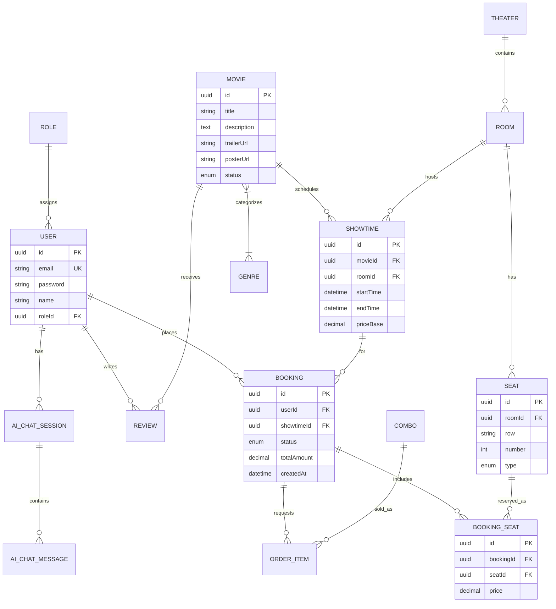

# 04. Entity-Relationship Diagram (ERD)

```mermaid
erDiagram
    ROLE ||--o{ USER : assigns
    USER ||--o{ BOOKING : places
    USER ||--o{ REVIEW : writes
    USER ||--o{ AI_CHAT_SESSION : has
    
    MOVIE ||--o{ SHOWTIME : schedules
    MOVIE }|--|{ GENRE : categorizes
    MOVIE ||--o{ REVIEW : receives
    
    THEATER ||--o{ ROOM : contains
    ROOM ||--o{ SEAT : has
    ROOM ||--o{ SHOWTIME : hosts
    
    SHOWTIME ||--o{ BOOKING : for
    
    BOOKING ||--o{ BOOKING_SEAT : includes
    BOOKING ||--o{ ORDER_ITEM : requests
    
    SEAT ||--o{ BOOKING_SEAT : reserved_as
    
    COMBO ||--o{ ORDER_ITEM : sold_as
    
    AI_CHAT_SESSION ||--o{ AI_CHAT_MESSAGE : contains

    USER {
        uuid id PK
        string email UK
        string password
        string name
        uuid roleId FK
    }

    MOVIE {
        uuid id PK
        string title
        text description
        string trailerUrl
        string posterUrl
        enum status
    }

    SHOWTIME {
        uuid id PK
        uuid movieId FK
        uuid roomId FK
        datetime startTime
        datetime endTime
        decimal priceBase
    }

    BOOKING {
        uuid id PK
        uuid userId FK
        uuid showtimeId FK
        enum status
        decimal totalAmount
        datetime createdAt
    }

    SEAT {
        uuid id PK
        uuid roomId FK
        string row
        int number
        enum type
    }

    BOOKING_SEAT {
        uuid id PK
        uuid bookingId FK
        uuid seatId FK
        decimal price
    }
```
