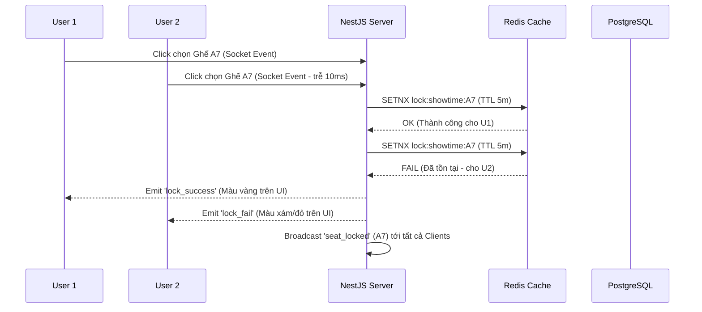
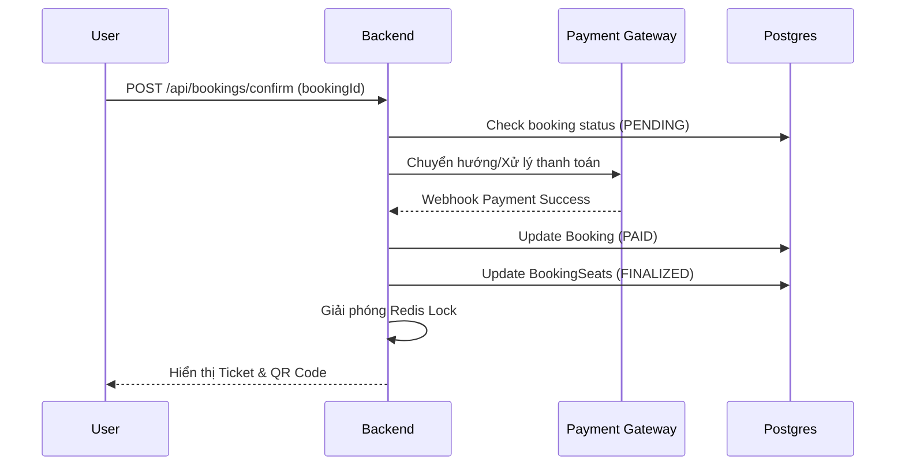
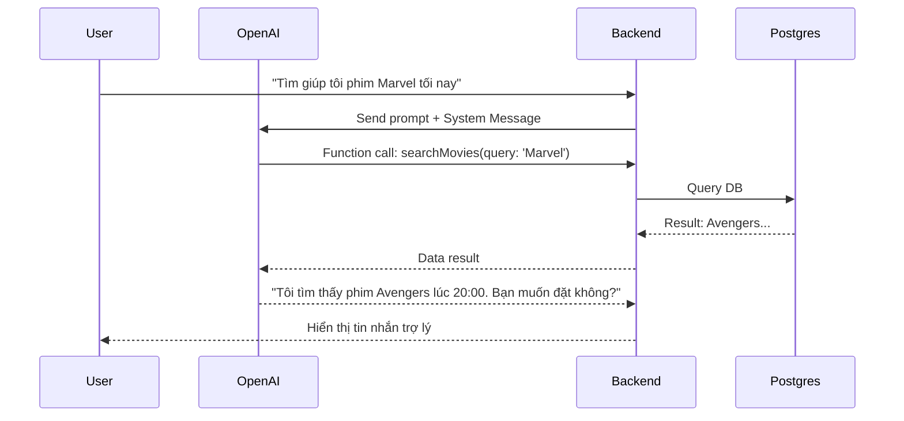

# 08. Sequence Diagrams (Mermaid)

## 1. Seat Locking Flow (Race Condition Prevention)
Đảm bảo hai người không thể chọn cùng một ghế cùng lúc.

## 2. Payment & Confirmation Flow

## 3. AI Booking Flow

