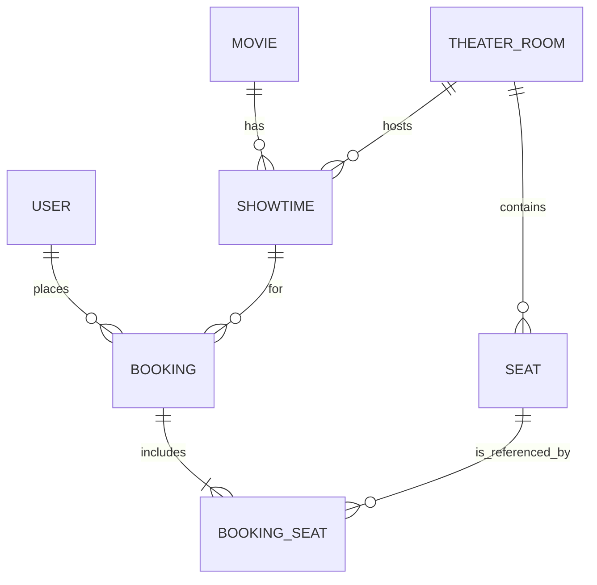

# Entity-Relationship Diagram (ERD)
# Sơ đồ Quan hệ Thực thể (ERD)

## 📌 Tables Overview (Tổng quan các Bảng)

### 1. User (Người dùng)
- `id`: UUID (Primary Key)
- `email`: String (Unique)
- `password`: String (Hashed)
- `role`: Enum (ADMIN, USER)
- `bookings`: Relation -> Booking[]

### 2. Movie (Phim)
- `id`: UUID (PK)
- `title`: String
- `description`: Text
- `status`: Enum (NOW_SHOWING, COMING_SOON)
- `trailerUrl`: String
- `posterUrl`: String
- `createdAt`: DateTime

### 3. Showtime (Suất chiếu)
- `id`: UUID (PK)
- `movieId`: UUID (FK -> Movie)
- `theaterRoomId`: UUID (FK -> TheaterRoom)
- `startTime`: DateTime
- `endTime`: DateTime
- `priceBase`: Decimal

### 4. TheaterRoom (Phòng chiếu)
- `id`: UUID (PK)
- `name`: String
- `capacity`: Int

### 5. Seat (Ghế)
- `id`: UUID (PK)
- `roomId`: UUID (FK -> TheaterRoom)
- `row`: String (Cột)
- `number`: Int (Số ghế)
- `type`: Enum (NORMAL, VIP, SWEETBOX)

### 6. Booking (Đặt vé)
- `id`: UUID (PK)
- `userId`: UUID (FK -> User)
- `showtimeId`: UUID (FK -> Showtime)
- `status`: Enum (PENDING, PAID, CANCELLED)
- `totalAmount`: Decimal

### 7. BookingSeat (Chi tiết Ghế đặt)
- `id`: UUID (PK)
- `bookingId`: UUID (FK -> Booking)
- `seatId`: UUID (FK -> Seat)
- `price`: Decimal

---
*Diagram (Mermaid)*:

