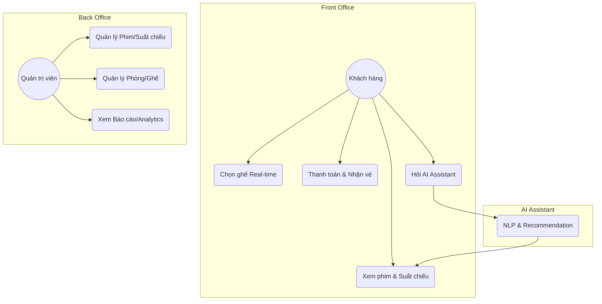

# Use Case Diagram
# Sơ đồ Use Case (Nghiệp vụ)

## 👤 Actors (Tác nhân)

### 1. User (Khách hàng)
- **Browse Movies**: Xem danh sách phim.
- **View Movie Details**: Xem chi tiết, trailer...
- **Book Ticket**: Chọn ghế & thanh toán.
- **Manage Account**: Lịch sử đặt vé.
- **Chat with AI Assistant**: Hỏi gợi ý phim & nhận hỗ trợ đặt vé.

### 2. Admin (Người quản trị)
- **Manage Movies**: Thêm, sửa, xóa phim.
- **Manage Showtimes**: Phân lịch suất chiếu.
- **Manage Rooms/Seats**: Quản lý phòng chiếu.
- **View Reports**: Xem doanh thu & thông tin đơn hàng.

## 🛡 System Administrative (Hệ thống)
- **AI Agent**: Xử lý logic NLP, gợi ý theo Mood.
- **Payment Gateway**: Xử lý giao dịch (MOCK/Stripe).

---
*Diagram (Mermaid)*:

