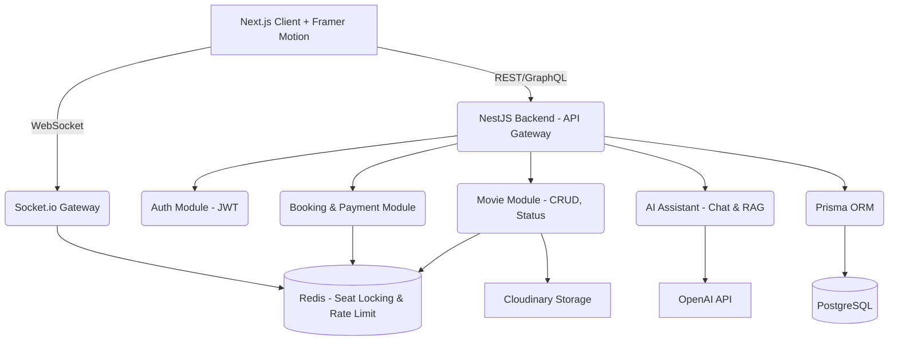

# Kế hoạch Triển khai (Implementation Plan) - Modern Cinema Web App

Cảm ơn bạn đã tin tưởng. Dưới góc độ của một Senior Full-stack Software Architect, tôi đã phân tích các yêu cầu hệ thống và thiết kế bản kiến trúc tổng thể (Architecture Design), lược đồ cơ sở dữ liệu (DB Schema), và lộ trình phát triển (Phased Roadmap) chia thành 8 giai đoạn rõ ràng.

## ⚠️ User Review Required

Vui lòng xem lại kiến trúc hệ thống, schema database và lộ trình các Phase bên dưới. Nếu bạn phê duyệt (approve), tôi sẽ tiến hành **tạo cấu trúc thư mục `plan/`** (như bạn yêu cầu) trong source code và bắt đầu triển khai ngay **Phase 1 & Phase 2** (Setup & Backend Core).

---

## 1. Kiến trúc Hệ thống (System Architecture)

> [!TIP]
> **Tech Stack Selection:**
> - **Frontend**: Next.js 14-15 (App Router) + TypeScript + TailwindCSS + Framer Motion (Chuẩn SEO, SSR nhanh, animation mượt mà). Phù hợp yêu cầu thiết kế Cinematic, Neon glow.
> - **Backend**: NestJS + TypeScript (Kiến trúc Module hóa chuẩn Enterprise, dễ scale hơn Express thuần).
> - **Real-time**: Socket.IO (Xử lý Seat locking theo thời gian thực - tránh double booking).
> - **Database**: PostgreSQL kết hợp Prisma ORM (Type-safe, dễ migration).
> - **Cache & Locking**: Redis (Lưu trữ trạng thái ghế đang bị lock tạm thời, cache API, tránh hit DB liên tục ở những API Hot như Showtime).
> - **Storage**: Cloudinary/S3 (Upload Hình ảnh, poster).
> - **AI Integration**: OpenAI API (Chatbot tư vấn phim theo mood, auto booking).

### Architecture Diagram (High-level)



---

## 2. Thiết kế Cơ sở dữ liệu (Database Schema)

> [!NOTE]
> DB Core Entities (Draft): User, Movie, TheaterRoom, Seat, Showtime, Booking, BookingSeat, OrderItem (Combo).

```prisma
// Lược đồ cơ bản (Mockup Prisma Schema)
model User {
  id        String   @id @default(uuid())
  email     String   @unique
  password  String
  role      Role     @default(USER) // ADMIN, USER
  bookings  Booking[]
  reviews   Review[]
}

model Movie {
  id          String   @id @default(uuid())
  title       String
  description String
  status      MovieStatus // NOW_SHOWING, COMING_SOON
  trailerUrl  String
  posterUrl   String
  showtimes   Showtime[]
  reviews     Review[]
}

model TheaterRoom {
  id       String   @id @default(uuid())
  name     String
  capacity Int
  seats    Seat[]
  showtimes Showtime[]
}

model Seat {
  id           String   @id @default(uuid())
  roomId       String
  row          String   // A, B, C...
  number       Int      // 1, 2, 3...
  type         SeatType // NORMAL, VIP, SWEETBOX
  bookingSeats BookingSeat[]
}

model Showtime {
  id        String   @id @default(uuid())
  movieId   String
  roomId    String
  startTime DateTime
  endTime   DateTime
  priceBase Float
  bookings  Booking[]
}

model Booking {
  id           String   @id @default(uuid())
  userId       String
  showtimeId   String
  status       BookingStatus // PENDING, PAID, CANCELLED
  totalAmount  Float
  seats        BookingSeat[]
  orderItems   OrderItem[] // Popcorn/Drinks (Combo)
}
```

---

## 3. Lộ trình Triển khai (Phased Development Plan)

Theo yêu cầu của bạn, tôi chia dự án làm 8 Phase. Mỗi khi bắt đầu một Phase, tôi sẽ cập nhật vào file `plan/phase-X/checklist.md` và `d:\Projects\cinema\.agent\CONTEXT.md`.

- **Phase 1: System Design (Hiện tại)**
  - Chốt Architecture, DB schema, API contract.
  - Setup cấu trúc thư mục `plan/` để track tiến độ (Sẽ sinh code thư mục này nếu bạn đồng ý).
  
- **Phase 2: Backend Core**
  - Setup NestJS (Boilerplate).
  - Tích hợp Prisma + PostgreSQL.
  - Viết module Auth (JWT login/register).
  - Viết module CRUD Movie & Showtime.
  
- **Phase 3: Frontend Core**
  - Setup Next.js, cấu hình Tailwind, Framer Motion.
  - Dựng layout (Dark theme mượt mà kiểu Netflix, Hero section với ghim video trailer).
  - Các trang Browse Movies (hover zoom card).

- **Phase 4: Seat Booking System (Critical)**
  - Backend: Tích hợp Redis và Socket.io. Viết logic Lock ghế realtime.
  - Frontend: UI chọn ghế (Grid layout). Micro-interactions. Sync trạng thái ghế.

- **Phase 5: Order & Payment**
  - Giỏ hàng (Bao gồm Ghế + Bắp/Nước `Combo`).
  - Checkout UI (Summary).
  - Tích hợp Simulate/Stripe Payment. Trang PDF Ticket (Smart Invoice/QR).

- **Phase 6: AI Assistant (Core Feature)**
  - Tích hợp OpenAI vào Backend.
  - Dùng function calling (Tool use): `searchMovies`, `bookTicket`.
  - Frontend Chat UI với Floating Button. Recommend tự động theo context.

- **Phase 7: Admin Dashboard**
  - Component quản lý Phim, Suất chiếu, Phòng chiếu.
  - Overview Revenue Charts.

- **Phase 8: Optimization & Smart features**
  - Caching (Redis cho truy vấn nhiều).
  - Tính năng "Cinematic Mode".
  - Deployment Docker/Vercel/Railway.

---

## 4. Open Questions (Cần bạn phản hồi)

> [!IMPORTANT]
> 1. Đồng ý với việc dùng **NestJS** làm Backend thay vì Express thuần chưa? (NestJS tốn thời gian setup boilerplate ban đầu hơn nhưng quản lý code cho một app phức tạp như thế này sẽ rất sạch).
> 2. Có muốn tôi viết một script tự động sinh ra toàn bộ thư mục `plan/phase-1` đến `plan/phase-8` cùng các file `checklist.md` và `plan.md` bên trong ngay khi bạn ấn Approve không?
> 3. Bạn đã có sẵn database URI trên (Postgres/Redis) chưa, hay tôi sẽ dùng file `.env` local Docker (Docker Compose setup) trong lúc dev để bạn tự run?

Chờ phản hồi (Approve) từ bạn để khởi động Phase 1 hoàn chỉnh!
